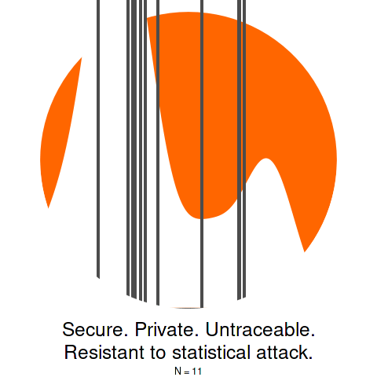

## Optimal Static Parametric Estimation of Arbitrary Distributions (OSPEAD) for the Monero decoy selection algorithm

This repo contains all submitted documents and code for OSPEAD, most of which has been private until now. OSPEAD is a proposed improvement to Monero's decoy selection algorithm that would reduce the probability that an anti-privacy adversary could correctly guess the real spend in a ring signature.



### Results summary

At current Monero ring size of 16, the theoretical minimum attack success through completely random guessing would be 1/16 = 6.25%. According to preliminary estimates, an adversary could take advantage of the divergence between the real spend age distribution and the status quo decoy distribution to achieve an attack success probability of 23.5%, on average, since the August 2022 hard fork. This corresponds to an effective ring size of 4.2. The attack success probability prior to August 2022 may be higher, but this was not measured due to time constraints.

The OSPEAD techniques suggest a new decoy distribution, which would reduce the average attack success probability to 7.6 percent, corresponding to an effective ring size of 13.2.

### Implementation and deployment

It is likely that deployment of a new decoy selection algorithm without a blockchain hard fork would do more harm than good due to some users being slow to upgrade. (For more information about the risk, read my ["Formula for Accuracy of Guessing Monero Real Spends Using Fungibility Defects"](https://github.com/Rucknium/misc-research/blob/main/Monero-Fungibility-Defect-Classifier/pdf/classify-real-spend-with-fungibility-defects.pdf). Therefore, the OSPEAD-derived decoy selection algorithm likely won't be implemented in Monero's standard wallet code before the next hard fork.

Monero's next hard fork is expected to deploy [Full Chain Membership Proofs](https://www.getmonero.org/2024/04/27/fcmps.html), which will eliminate the on-chain ring signature privacy model. However, in certain situations, decoy-based privacy will still be used to provide protection to users' wallets from a potentially malicious spying remote node. Therefore, the OSPEAD-derived decoy distribution can be used in those circumstances. For more details, read ["Initial Probability Density Function for OSPEAD"](CCS-milestone-2/pdf/OSPEAD-milestone-II.pdf).

The OSPEAD documents and code are being publicly released now because there is now an implementable solution to the problems I raised in my original HackerOne submission. Public release will allow greater review and scrutiny of the proposed OSPEAD techniques.

### Documents list

There are three groups of documents, placed in their own directories in the repo:

- `HackerOne-submission` contains my submission to Monero's HackerOne vulnerability response process in September 2021, titled "Research Roadmap for an Overhaul of Monero’s Mixin Selection Algorithm". This was the initial research that suggested a major privacy problem in Monero's decoy selection algorithm, but it did not solve all challenges involving estimating the real spend age distribution, especially the handling of multiple nonstandard decoy selection algorithms being used in the wild. These issues required further research, which was funded by [Monero's Community Crowdfunding System (CCS)](https://ccs.getmonero.org/proposals/Rucknium-OSPEAD-Fortifying-Monero-Against-Statistical-Attack.html).

- `CCS-milestone-1` contains the "Fully Specified Estimation Plan for OSPEAD" document and code submitted in September 2022 as Milestone 1 of the [CCS-funded OSPEAD research project](https://ccs.getmonero.org/proposals/Rucknium-OSPEAD-Fortifying-Monero-Against-Statistical-Attack.html).

- `CCS-milestone-2`contains documents and code submitted in January 2025 as Milestone 2 of the OSPEAD research project. The documents are split into a "Initial Probability Density Function for OSPEAD" PDF and a browser-based website combining procedural narrative and code, viewable at [OSPEAD-docs](https://rucknium.github.io/OSPEAD/CCS-milestone-2/OSPEAD-docs/_book).

- `old-repo` contains code from the earlier version of this repository.

### How to read the documents

The documents total well over 100 pages. I will suggest portions to read:

- Laypeople (i.e. non-technical people) are suggested to read Sections 19 through 20 (pages 39 to 42) of ["Fully Specified Estimation Plan for OSPEAD"](CCS-milestone-1/pdf/PRIVATE-OSPEAD-Fully-Specified-Estimation-Plan.pdf) and ["Research Roadmap for an Overhaul of Monero’s Mixin Selection Algorithm"](HackerOne-submission/pdf/Roadmap-for-improved-Monero-mixin-selection-algorithm.pdf). Note that the term "mixin" in the latter document changed to "decoy" in the former document.

- Programmers and/or people who prefer to read procedures are suggested to read ["Research Roadmap for an Overhaul of Monero’s Mixin Selection Algorithm"](HackerOne-submission/pdf/Roadmap-for-improved-Monero-mixin-selection-algorithm.pdf) and [OSPEAD-docs](https://rucknium.github.io/OSPEAD/CCS-milestone-2/OSPEAD-docs/_book). Note that the term for the adversary's attack changed from "Rucknium Ratio Attack" to "Maximum A Postieri (MAP) Decoder attack".

- People interested in the statistical theory underpinning OSPEAD are encouraged to read all of ["Fully Specified Estimation Plan for OSPEAD"](CCS-milestone-1/pdf/PRIVATE-OSPEAD-Fully-Specified-Estimation-Plan.pdf).


### Installing the `decoyanalysis` R package

The `decoyanalysis` R package is a necessary (but not sufficient) condition to reproduce the OSPEAD analysis in Milestone 2. To install `decoyanalysis`, start an R session and input:

```R
install.packages("remotes")
remotes::install_github("Rucknium/OSPEAD",
  subdir = "CCS-milestone-2/decoyanalysis", upgrade = FALSE)
```

On Linux, you may have to install the `liblapack-dev` system package first:

```bash
sudo apt install liblapack-dev
```

### Funding

Most of this research was funded by [Monero's Community Crowdfunding System (CCS)](https://ccs.getmonero.org/proposals/Rucknium-OSPEAD-Fortifying-Monero-Against-Statistical-Attack.html). Thank you to all donors!


