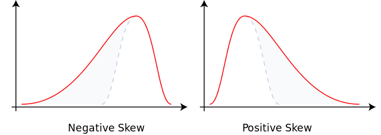

```{css, echo=FALSE}
body .main-container {
  max-width: 1250px !important;
  width: 1250px !important;
}
body {
  max-width: 1250px !important;
}

```


```{r setup, include = FALSE}
knitr::opts_chunk$set(echo = TRUE)
library(ggplot2)
library(data.table)
library(doParallel)
library(huxtable)
library(katex)


blockchain.args <- list(
  BTC  = list(data.dir = "", target.block.time = 600),
  BCH  = list(data.dir = "", target.block.time = 600),
  LTC  = list(data.dir = "", target.block.time = 150),
  DOGE = list(data.dir = "", target.block.time = 60)
)
# Must add path to master_edgelist_output_spent-uncompressed.rds file
# for each blockchain, with trailing slash.


drightparetolognormal.stable <- function(x, shape2 = 1.5, meanlog = -0.5, sdlog = 0.5, log = FALSE)  {
  d <- log(shape2 * x^(-shape2 - 1)) +  
    (shape2 * meanlog + (shape2^2 * sdlog^2)/2) + 
    pnorm((log(x) - meanlog - shape2 * sdlog^2)/sdlog, log.p = TRUE)
  if (!log) {
    d <- exp(d)
  }
  return(d)
}
# Based on distributionsrd::drightparetolognormal, but 
# log-linearized to be more numerically stable


```

## Summary characterization of distributions over time

The first set of graphs show several statistics about the age of spent outputs of BTC, BCH, LTC, and DOGE since 2015. The age units are in terms of blocks. For BTC and BCH the interval between blocks is 10 minutes. For LTC it is 2.5 minutes and for DOGE it is 1 minute. The unit of observation is the [ISO week](https://en.wikipedia.org/wiki/ISO_week_date), a natural unit of economic time.

The first line graphs show the mean, median, standard deviation, skewness, and kurtosis. The skewness and kurtosis statistics may be unfamiliar. They are the third and fourth standardized moments of a distribution, respectively. The moments of a distribution is defined by a power of the expectation $\mathrm{E}[X]$, i.e. theoretical mean, of the distribution. The $k$th moment is $\mathrm{E}[X^{k}]$. Moments extend the concept of moving from expectation to variance (which is the square of the standard deviation). The mean (expectation) of a random variable is simply the first moment:

$$\mu=\mathrm{E}[X^{1}]$$

The variance is the second central moment:

$$\sigma^{2}=\mathrm{E}\left[\left(X-\mathrm{E}[X]\right)^{2}\right]$$

The skewness is the third standardized moment (standardized by the standard deviation $\sigma$):

$$\tilde{\mu}_{3}=\mathrm{E}\left[\left(\dfrac{X-\mathrm{E}[X]}{\sigma}\right)^{3}\right]$$

The kurtosis is the fourth standardized moment:

$$\tilde{\mu}_{4}=\mathrm{E}\left[\left(\dfrac{X-\mathrm{E}[X]}{\sigma}\right)^{4}\right]$$

The mean is a measure of the central tendency of a distribution. The standard deviation is a measure of its dispersion (spread). The skewness and kurtosis of a distribution involve its characteristics in its tail or tails. A positive skew means that the distribution's tail is on the right side of the distribution. All the age distributions analyzed here tend to have a positive skew. High kurtosis means that large outliers are more likely. Kurtosis of greater than 3 suggests that a distribution has a fatter tail than the normal distribution. The skewness and kurtosis become relevant when very old outputs “wake up” during periods of exchange rate volatility to participate in speculative activity, i.e. buying and selling on exchanges.


```{r skewness-image, echo=FALSE, fig.align='center', fig.cap="Skewness. From https://en.wikipedia.org/wiki/File:Negative_and_positive_skew_diagrams_(English).svg"}

```


The fitting function is essentially a minimum discrepancy estimator. This means that the parameters of the parametric probability density function (PDF) are chosen to minimize the distance between the parametric PDF and the PDF formed by the data (the empirical PDF), for some specified metric of “distance”. 

There are several measures of distance that could be used. For the purpose of this exploration of output age distribution forecasting, the distance metric to be minimized will be the total linear sum of the mass of the estimated parametric PDF that falls below the empirical PDF. With the “loss function” specified this way, the optimization algorithm attempts to minimize the probability that the real spends are much more likely to come from a block of a particular age compared to a potential decoy. Ideally, the decoy distribution would be identical to the real spend distribution, but parametric PDFs are not flexible enough to perfectly match an empirical PDF.

Define $f_{S}(x)$ as the empirical spent output age distribution at block age $x$ and $f_{D}(x;\boldsymbol{\beta})$ as a potential “decoy” distribution with some parameter vector $\boldsymbol{\beta}$ (with the transparent blockchains presented here, there is no actual decoy mechanism of course). Then for each week of spent output age data the parameter vector $\boldsymbol{\beta}$ can be chosen to minimize this quantity:

$$L(\boldsymbol{\beta})=\sum_{i\in\{x_{i}:f_{D}(x_{i};\boldsymbol{\beta})<f_{S}(x_{i})\}}^{N}f_{S}(x_{i})-f_{D}(x_{i};\boldsymbol{\beta})$$

That is, minimize the sum of the difference between the real spend age distribution for blocks $x_{i}$ where the decoy distribution is less than the real spend age distribution. The minimization is performed by computer numerical minimization methods similar to gradient descent.

The two candidate “decoy” parametric PDFs under consideration in this exercise are the Log-gamma (*lgamma*) distribution and the Right-Pareto Log-normal (*rpln*) distribution. The lgamma distribution, with two parameters, was used in Moser et al. (2018) to suggest a decoy distribution that was later incorporated into Monero's reference wallet software. The rpln distribution is a more flexible distribution, with three parameters. The PDFs of these two distributions are:

$$f_{lgamma}(x)=\dfrac{ratelog^{shapelog}}{\Gamma(shapelog)}\cdot\dfrac{(\ln x)^{shapelog-1}}{x^{ratelog+1}}$$

with $ratelog>0$ and $shapelog>0$ and where $\Gamma$ is the gamma function and

$$f_{rpln}(x)=shape2\cdot x^{-shape2-1}e^{shape2\cdot meanlog+\frac{shape2^{2}sdlog^{2}}{2}}\Phi(\frac{\ln x-meanlog-shape2\cdot sdlog^{2}}{sdlog})$$

with $shape2>0$ and $sdlog>0$ and where $\Phi$ is the cumulative distribution function of the standard Normal distribution.


```{r characterization-line-charts, echo = FALSE, fig.width = 8, fig.height = 8, out.width = "75%", fig.align='center'}

blockchain.results <- readRDS(file = paste0(blockchain.args$BTC$data.dir, "blockchain-results.rds"))

for (blockchain in names(blockchain.args)) {
  
  lgamma.par <- as.data.table(t(sapply(blockchain.results[[blockchain]]$weekly.age[["lgamma"]], function(x) {
    x$par
  })))
  
  rpln.par <- as.data.table(t(sapply(blockchain.results[[blockchain]]$weekly.age[["rpln"]], function(x) {
    x$par
  })))
  
  lgamma.par[, shapelog := exp(shapelog)]
  lgamma.par[, ratelog := exp(ratelog)]
  rpln.par[, shape2 := exp(shape2)]
  rpln.par[, sdlog := exp(sdlog)]
  # re-transform param values
  
  colnames(rpln.par) <- paste0("rpln.", colnames(rpln.par))
  colnames(lgamma.par) <- paste0("lgamma.", colnames(lgamma.par))
  
  all.stats <- blockchain.results[[blockchain]]$summary.stats
  
  all.stats <- cbind(week = blockchain.results[[blockchain]]$week.set,
    all.stats, lgamma.par, rpln.par)
  
  blockchain.results[[blockchain]]$all.stats <- all.stats
  

  all.stats.plot <- melt(all.stats, id.vars = "week")

  all.stats.plot[, week := factor(week)]
  
  linecolor <- switch(blockchain, BTC = "orange", BCH = "darkgreen", LTC = "gray47", DOGE = "yellow3")

  print(
    ggplot(data = all.stats.plot, aes(x = week, y = value, group = 1)) +
      geom_line(colour = linecolor) +
      ggtitle(blockchain) +
      facet_grid(variable ~ ., scales = "free_y") +
      scale_x_discrete(position = "top",
        breaks = levels(all.stats.plot$week)[seq(1, length(levels(all.stats.plot$week)), 8)]) +
      theme(text = element_text(size = 7), axis.text.x = element_text(angle = 90, vjust = 0.5, hjust = 1))
  )

}


```

## Cross-blockchain correlations of summary statistics across time

The following table contains the correlation between several statistics over time for each pair of blockchains. The "BTC&BCH" correlation included data only for January 2018 onward to avoid artificially raising the correlation by including weeks when the BTC and BCH contained the same transaction before the August 2017 hard fork.

To be precise, define vector $[x_{s,1},x_{s,2},\ldots,x_{s,W}]=\mathbf{X}_{s}$ for statistic $s$, e.g. the median, of blockchain $x$ at each week, with $W$ total weeks in the sample. Define $\mathbf{Y}_{s}$ for blockchain $y$ similarly. Then the quantities displayed in the table below are $corr(\mathbf{X}_{s},\mathbf{Y}_{s})$.

The two statistics that tend to have consistently high correlation for each pair of blockchains are skewness and kurtosis.

```{r correlation-tables, echo=FALSE, fig.align='center'}


cor.combn <- t(combn(names(blockchain.args), 2))


cor.results <- apply(cor.combn, 1, FUN = function(x) {
  if (setequal(x, c("BTC", "BCH"))) {
    return(
      diag(cor(
        blockchain.results[[ x[1] ]]$all.stats[grepl("(201[8-9])|(202[0-2])", week), ][, -1, with = FALSE],
        blockchain.results[[ x[2] ]]$all.stats[grepl("(201[8-9])|(202[0-2])", week), ][, -1, with = FALSE]
    ))
    )
  }
  diag(cor(
    blockchain.results[[ x[1] ]]$all.stats[, -1, with = FALSE],
    blockchain.results[[ x[2] ]]$all.stats[, -1, with = FALSE]
  ))
  
})

colnames(cor.results) <- paste0(cor.combn[, 1], "&", cor.combn[, 2])

kableExtra::kable_styling(knitr::kable(cor.results, format = "html", digits = 2))


```

## Evaluation of forecast accuracy

OSPEAD needs to approximate the real spend distribution in the future, not the past. Ideally, the decoy selection algorithm should mimic the real spend distribution at the time that each transaction is made. Since the real spend distribution is likely changing over time, some type of forecasting is needed. Here I perform some simple evaluation of forecasting methods on transparent blockchains.

Let $W$ be the number of weeks in a forecast horizon. It is the approximate interval of time that a proposed decoy selection algorithm should aim to be accurate. Let $M$ be the number of weeks in the data sample. Then a common way to evaluate a forecasting method is to use the first $M-W$ weeks to fit a forecasting model. Then determine the performance of the method by forecasting for $W$ weeks into the "future" and compare with the actual sample data of the final $W$ weeks. This forecast evaluation method is called many names by various sources: out-of-sample validation, walk-forward validation, and last block validation. For this exercise, I set $W = 8$.

An entire distribution needs to be forecasted rather than a single or a set of values. Forecasting an entire (empirical, nonparametric) distribution is extremely complex, so here I reduce the magnitude of the forecasting problem to just the parameters of the fitted parametric distributions (lgamma and rpln).

As an initial test, the sophisticated forecasting method used here was a multivariate auto-regressive(1) exogenous inputs state-space model with a Koopman-Durbin Kalman filter implemented in the [MARSS](https://cran.r-project.org/package=MARSS) R package. The forecasting method allows a forecast into each period in the future. Since the "S" in OSPEAD stands for "Static", only one of the forecasted periods can be chosen. I chose the 4th forecasted period since it is roughly in the middle of the 8-week forecast horizon. This forecast is referred to as simply `forecast.accuracy` below.

I also evaluated two naive forecasting methods. The first is to use the parameters of the $M-W$th week, i.e. the last week of the "training set", as the forecast. This is called `forecast.accuracy.naive.final.week` below. The second naive method (`forecast.accuracy.naive.horizon.period`) is to use the final $W$ weeks of the training set to fit the specified lgamma and rpln distributions by minimizing the $L(\boldsymbol{\beta})$ loss function for a set of weeks of data pooled together rather than a single week.

Given that the loss function $L(\boldsymbol{\beta})$ is not globally convex in the choice parameters $\boldsymbol{\beta}$, the numerical optimization algorithm can go "off the rails" and settle at a local rather than global minimum. Such a failure mode is especially likely if the empirical distribution is unusual or if the starting values given to the optimization algorithm are farm from the global minimum. Generally, the solution to this problem is to try different optimization algorithms, determined better starting values, or use a computationally expensive grid search method. I chose to defer dealing with the issue to a later stage in the process. For the purposes of forecasting, I removed any weeks where the estimated parameters of the parametric distributions were farther than (or less than) five times the 95th (5th) percentile from the median. For example, this exclusion step caused the forecast evaluation for BCH to use the 15th through 24th weeks of 2022 rather than the 20th through 27th week as for other blockchains.

Below are the results of the forecast evaluation. Forecasts were evaluated based on the value of their loss function $\boldsymbol{\beta}$ for each out-of-sample week. Lower values indicate better performance. The minimum possible value is 0 and the maximum possible value is 1. The color code scales were calculated separately for each blockchain. Each color claims a value bin of equal size. Higher values are red, average values are yellow, and low values are green.

In this preliminary exercise, `rpln.forecast.accuracy.naive.horizon.period` appears to have the most consistent good performance across blockchains.


```{r forecast-tables, echo=FALSE, fig.align='center'}  

forecast.tables <- lapply(blockchain.results, FUN = function(x) {
  cbind(mean = sapply(unlist(x$forecast.results, recursive = FALSE), mean),
    sd = sapply(unlist(x$forecast.results, recursive = FALSE), sd),
    do.call(rbind, unlist(x$forecast.results, recursive = FALSE)))
})

printed.huxes <- list()

for ( i in names(forecast.tables)) {
  
  # [, -2] to remove sd
  color.range <- seq(min(forecast.tables[[i]][, -2]), max(forecast.tables[[i]][, -2]), length.out = 12)

  color.range <- cut(forecast.tables[[i]][, -2], color.range, labels = rev(RColorBrewer::brewer.pal(11, "RdYlGn")), include.lowest = TRUE )

  hux.forecast.table <- huxtable::as_hux(forecast.tables[[i]], add_colnames = TRUE, add_rownames = TRUE)
  hux.forecast.table <- huxtable::set_number_format(hux.forecast.table,
    row = seq_len(nrow(forecast.tables[[i]])) + 1, col = seq_len(ncol(forecast.tables[[i]])) + 1,
    value = 4)
  
  caption(hux.forecast.table) <- i

  printed.huxes[[i]] <- huxtable::set_background_color(hux.forecast.table, 
    row = seq_len(nrow(forecast.tables[[i]])) + 1, col = seq_len(ncol(forecast.tables[[i]]))[-2] + 1,
    value = as.character(color.range))
  

}


printed.huxes[[1]]
printed.huxes[[2]]
printed.huxes[[3]]
printed.huxes[[4]]


```

## Animated evolution of distributions

Below are gif animations of the empirical probability densities of each blockchain's spent output age distribution over time. The green line is the current week's empirical density, with faint echoes of prior weeks in other colors. The fitted lgamma distribution line is white and rpln is red. The horizontal axis of the first charts for each blockchain has a log scale. Both the horizontal and vertical charts are log scale for the second chart of each blockchain. The "1" on the horizontal axis should be interpreted as "0". In other words, a "1" means that the age of the spent output is approximately zero. This would occur if (1) a transaction spent an output that was confirmed in the same block as the child transaction; (2) the timestamps of blocks were out of order, leading to a "negative" age; (3) the block was confirmed at a time interval less than half of the target block time, e.g. 5 minutes for BTC/BCH, leading to rounding down to zero.

There is a clear daily cycle visible in the log-log scale charts.


```{r BTC-log-linear-gif, cache = TRUE, cache.lazy = FALSE, echo = FALSE, fig.width = 5, fig.height = 5, out.width = "75%", animation.hook='gifski', interval = 0.5, fig.align='center'}


for (blockchain in "BTC") {
  

  weekly.age  <- blockchain.results[[blockchain]]$weekly.age
  
  support.viz <- 0:10000
  
  empirical.pmf <- blockchain.results[[blockchain]]$empirical.pmf
  
  
  year.week.range <- names(empirical.pmf)
  
  weekly.historical.length <- 52/2
  
  col.palette <- viridis::magma(weekly.historical.length)
  
  for (i in seq_along(year.week.range) ) {
    
    subset.seq <- 1:i
    subset.seq <- subset.seq[max(1, i - weekly.historical.length + 1):max(subset.seq)]
    col.palette.subset <- col.palette[max(1, weekly.historical.length - i + 1):weekly.historical.length]
    col.palette.subset[length(col.palette.subset)] <- "green"
    
    year.week.range.subset <- year.week.range[subset.seq]
    
    par(bg = 'black', fg = 'white') 
    
    plot(1, 
      main = paste0("Distribution of ", blockchain, " spent output age,\nby week of transaction"),
      sub = year.week.range[i],
      ylab = "Empirical probability", xlab = "Age in number of blocks (log scale)",
      col.lab = "white", col.axis = "white", col.main = "white", col.sub = "white",
      col = "transparent", log = "x",
      xlim = range(support.viz) + 1, ylim = c(.0000002, 0.2))
    
    for ( j in seq_along(subset.seq)) {
      
      lines(
        support.viz[-length(support.viz)] + 1,
        empirical.pmf[[year.week.range.subset[j]]][support.viz[-length(support.viz)] + 1],
        col = col.palette.subset[j],
        lwd = ifelse(j == length(subset.seq), 2, 0.5)
      )
      
    }
    
    lines(
      support.viz[-length(support.viz)],
      drightparetolognormal.stable(support.viz[-length(support.viz)] + 1, 
        shape2 = exp(weekly.age[["rpln"]][[i]]$par[1]),
        meanlog = weekly.age[["rpln"]][[i]]$par[2],
        sdlog = exp(weekly.age[["rpln"]][[i]]$par[3])),
      col = "red", lwd = 2)
    
    lines(
      support.viz[-length(support.viz)] ,
      actuar::dlgamma(support.viz[-length(support.viz)] + 2, 
        shapelog = exp(weekly.age[["lgamma"]][[i]]$par[1]),
        ratelog = exp(weekly.age[["lgamma"]][[i]]$par[2])),
      col = "white", lwd = 2)
    
    legend("topright", legend = c("lgamma", "rpln"), bty = "n",
      col = c("white", "red"), lwd = rep(2, 2))
    
    
  }
  
}


```


```{r BTC-log-log-gif, cache = TRUE, cache.lazy = FALSE, echo = FALSE, fig.width = 5, fig.height = 5, out.width = "75%", animation.hook='gifski', interval = 0.5, fig.align='center'}


for (blockchain in "BTC") {
  

  weekly.age  <- blockchain.results[[blockchain]]$weekly.age
  
  support.viz <- 0:10000
  
  empirical.pmf <- blockchain.results[[blockchain]]$empirical.pmf
  
  
  year.week.range <- names(empirical.pmf)
  
  weekly.historical.length <- 52/2
  
  col.palette <- viridis::magma(weekly.historical.length)
  
  for (i in seq_along(year.week.range) ) {
    
    subset.seq <- 1:i
    subset.seq <- subset.seq[max(1, i - weekly.historical.length + 1):max(subset.seq)]
    col.palette.subset <- col.palette[max(1, weekly.historical.length - i + 1):weekly.historical.length]
    col.palette.subset[length(col.palette.subset)] <- "green"
    
    year.week.range.subset <- year.week.range[subset.seq]
    
    par(bg = 'black', fg = 'white') 
    
    plot(1, 
      main = paste0("Distribution of ", blockchain, " spent output age,\nby week of transaction"),
      sub = year.week.range[i],
      ylab = "Empirical probability (log scale)", xlab = "Age in number of blocks (log scale)",
      col.lab = "white", col.axis = "white", col.main = "white", col.sub = "white",
      col = "transparent", log = "xy",
      xlim = range(support.viz) + 1, ylim = c(.0000002, 0.2))
    
    for ( j in seq_along(subset.seq)) {
      
      lines(
        support.viz[-length(support.viz)] + 1,
        empirical.pmf[[year.week.range.subset[j]]][support.viz[-length(support.viz)] + 1],
        col = col.palette.subset[j],
        lwd = ifelse(j == length(subset.seq), 2, 0.5)
      )
      
    }
    
    lines(
      support.viz[-length(support.viz)],
      drightparetolognormal.stable(support.viz[-length(support.viz)] + 1, 
        shape2 = exp(weekly.age[["rpln"]][[i]]$par[1]),
        meanlog = weekly.age[["rpln"]][[i]]$par[2],
        sdlog = exp(weekly.age[["rpln"]][[i]]$par[3])),
      col = "red", lwd = 2)
    
    lines(
      support.viz[-length(support.viz)] ,
      actuar::dlgamma(support.viz[-length(support.viz)] + 2, 
        shapelog = exp(weekly.age[["lgamma"]][[i]]$par[1]),
        ratelog = exp(weekly.age[["lgamma"]][[i]]$par[2])),
      col = "white", lwd = 2)
    
    legend("topright", legend = c("lgamma", "rpln"), bty = "n",
      col = c("white", "red"), lwd = rep(2, 2))
    
    
  }
  
}


```


```{r BCH-log-linear-gif, cache = TRUE, cache.lazy = FALSE, echo = FALSE, fig.width = 5, fig.height = 5, out.width = "75%", animation.hook='gifski', interval = 0.5, fig.align='center'}


for (blockchain in "BCH") {
  

  weekly.age  <- blockchain.results[[blockchain]]$weekly.age
  
  support.viz <- 0:10000
  
  empirical.pmf <- blockchain.results[[blockchain]]$empirical.pmf
  
  
  
  year.week.range <- names(empirical.pmf)
  
  weekly.historical.length <- 52/2
  
  col.palette <- viridis::magma(weekly.historical.length)
  
  for (i in seq_along(year.week.range) ) {
    
    subset.seq <- 1:i
    subset.seq <- subset.seq[max(1, i - weekly.historical.length + 1):max(subset.seq)]
    col.palette.subset <- col.palette[max(1, weekly.historical.length - i + 1):weekly.historical.length]
    col.palette.subset[length(col.palette.subset)] <- "green"
    
    year.week.range.subset <- year.week.range[subset.seq]
    
    par(bg = 'black', fg = 'white') 
    
    plot(1, 
      main = paste0("Distribution of ", blockchain, " spent output age,\nby week of transaction"),
      sub = year.week.range[i],
      ylab = "Empirical probability", xlab = "Age in number of blocks (log scale)",
      col.lab = "white", col.axis = "white", col.main = "white", col.sub = "white",
      col = "transparent", log = "x",
      xlim = range(support.viz) + 1, ylim = c(.0000002, 0.2))
    
    for ( j in seq_along(subset.seq)) {
      
      lines(
        support.viz[-length(support.viz)] + 1,
        empirical.pmf[[year.week.range.subset[j]]][support.viz[-length(support.viz)] + 1],
        col = col.palette.subset[j],
        lwd = ifelse(j == length(subset.seq), 2, 0.5)
      )
      
    }
    
    lines(
      support.viz[-length(support.viz)],
      drightparetolognormal.stable(support.viz[-length(support.viz)] + 1, 
        shape2 = exp(weekly.age[["rpln"]][[i]]$par[1]),
        meanlog = weekly.age[["rpln"]][[i]]$par[2],
        sdlog = exp(weekly.age[["rpln"]][[i]]$par[3])),
      col = "red", lwd = 2)
    
    lines(
      support.viz[-length(support.viz)] ,
      actuar::dlgamma(support.viz[-length(support.viz)] + 2, 
        shapelog = exp(weekly.age[["lgamma"]][[i]]$par[1]),
        ratelog = exp(weekly.age[["lgamma"]][[i]]$par[2])),
      col = "white", lwd = 2)
    
    legend("topright", legend = c("lgamma", "rpln"), bty = "n",
      col = c("white", "red"), lwd = rep(2, 2))
    
    
  }
  
}


```


```{r BCH-log-log-gif, cache = TRUE, cache.lazy = FALSE, echo = FALSE, fig.width = 5, fig.height = 5, out.width = "75%", animation.hook='gifski', interval = 0.5, fig.align='center'}


for (blockchain in "BCH") {
  

  weekly.age  <- blockchain.results[[blockchain]]$weekly.age
  
  support.viz <- 0:10000
  
  empirical.pmf <- blockchain.results[[blockchain]]$empirical.pmf
  
  
  
  year.week.range <- names(empirical.pmf)
  
  weekly.historical.length <- 52/2
  
  col.palette <- viridis::magma(weekly.historical.length)
  
  for (i in seq_along(year.week.range) ) {
    
    subset.seq <- 1:i
    subset.seq <- subset.seq[max(1, i - weekly.historical.length + 1):max(subset.seq)]
    col.palette.subset <- col.palette[max(1, weekly.historical.length - i + 1):weekly.historical.length]
    col.palette.subset[length(col.palette.subset)] <- "green"
    
    year.week.range.subset <- year.week.range[subset.seq]
    
    par(bg = 'black', fg = 'white') 
    
    plot(1, 
      main = paste0("Distribution of ", blockchain, " spent output age,\nby week of transaction"),
      sub = year.week.range[i],
      ylab = "Empirical probability (log scale)", xlab = "Age in number of blocks (log scale)",
      col.lab = "white", col.axis = "white", col.main = "white", col.sub = "white",
      col = "transparent", log = "xy",
      xlim = range(support.viz) + 1, ylim = c(.0000002, 0.2))
    
    for ( j in seq_along(subset.seq)) {
      
      lines(
        support.viz[-length(support.viz)] + 1,
        empirical.pmf[[year.week.range.subset[j]]][support.viz[-length(support.viz)] + 1],
        col = col.palette.subset[j],
        lwd = ifelse(j == length(subset.seq), 2, 0.5)
      )
      
    }
    
    lines(
      support.viz[-length(support.viz)],
      drightparetolognormal.stable(support.viz[-length(support.viz)] + 1, 
        shape2 = exp(weekly.age[["rpln"]][[i]]$par[1]),
        meanlog = weekly.age[["rpln"]][[i]]$par[2],
        sdlog = exp(weekly.age[["rpln"]][[i]]$par[3])),
      col = "red", lwd = 2)
    
    lines(
      support.viz[-length(support.viz)] ,
      actuar::dlgamma(support.viz[-length(support.viz)] + 2, 
        shapelog = exp(weekly.age[["lgamma"]][[i]]$par[1]),
        ratelog = exp(weekly.age[["lgamma"]][[i]]$par[2])),
      col = "white", lwd = 2)
    
    legend("topright", legend = c("lgamma", "rpln"), bty = "n",
      col = c("white", "red"), lwd = rep(2, 2))
    
    
  }
  
}


```


```{r LTC-log-linear-gif, cache = TRUE, cache.lazy = FALSE, echo = FALSE, fig.width = 5, fig.height = 5, out.width = "75%", animation.hook='gifski', interval = 0.5, fig.align='center'}


for (blockchain in "LTC") {
    

  weekly.age  <- blockchain.results[[blockchain]]$weekly.age
  
  support.viz <- 0:10000
  
  empirical.pmf <- blockchain.results[[blockchain]]$empirical.pmf
  
  
  
  year.week.range <- names(empirical.pmf)
  
  weekly.historical.length <- 52/2
  
  col.palette <- viridis::magma(weekly.historical.length)
  
  for (i in seq_along(year.week.range) ) {
    
    subset.seq <- 1:i
    subset.seq <- subset.seq[max(1, i - weekly.historical.length + 1):max(subset.seq)]
    col.palette.subset <- col.palette[max(1, weekly.historical.length - i + 1):weekly.historical.length]
    col.palette.subset[length(col.palette.subset)] <- "green"
    
    year.week.range.subset <- year.week.range[subset.seq]
    
    par(bg = 'black', fg = 'white') 
    
    plot(1, 
      main = paste0("Distribution of ", blockchain, " spent output age,\nby week of transaction"),
      sub = year.week.range[i],
      ylab = "Empirical probability", xlab = "Age in number of blocks (log scale)",
      col.lab = "white", col.axis = "white", col.main = "white", col.sub = "white",
      col = "transparent", log = "x",
      xlim = range(support.viz) + 1, ylim = c(.0000002, 0.2))
    
    for ( j in seq_along(subset.seq)) {
      
      lines(
        support.viz[-length(support.viz)] + 1,
        empirical.pmf[[year.week.range.subset[j]]][support.viz[-length(support.viz)] + 1],
        col = col.palette.subset[j],
        lwd = ifelse(j == length(subset.seq), 2, 0.5)
      )
      
    }
    
    lines(
      support.viz[-length(support.viz)],
      drightparetolognormal.stable(support.viz[-length(support.viz)] + 1, 
        shape2 = exp(weekly.age[["rpln"]][[i]]$par[1]),
        meanlog = weekly.age[["rpln"]][[i]]$par[2],
        sdlog = exp(weekly.age[["rpln"]][[i]]$par[3])),
      col = "red", lwd = 2)
    
    lines(
      support.viz[-length(support.viz)] ,
      actuar::dlgamma(support.viz[-length(support.viz)] + 2, 
        shapelog = exp(weekly.age[["lgamma"]][[i]]$par[1]),
        ratelog = exp(weekly.age[["lgamma"]][[i]]$par[2])),
      col = "white", lwd = 2)
    
    legend("topright", legend = c("lgamma", "rpln"), bty = "n",
      col = c("white", "red"), lwd = rep(2, 2))
    
    
  }
  
}


```


```{r LTC-log-log-gif, cache = TRUE, cache.lazy = FALSE, echo = FALSE, fig.width = 5, fig.height = 5, out.width = "75%", animation.hook='gifski', interval = 0.5, fig.align='center'}


for (blockchain in "LTC") {
    

  weekly.age  <- blockchain.results[[blockchain]]$weekly.age
  
  support.viz <- 0:10000
  
  empirical.pmf <- blockchain.results[[blockchain]]$empirical.pmf
  
  
  
  year.week.range <- names(empirical.pmf)
  
  weekly.historical.length <- 52/2
  
  col.palette <- viridis::magma(weekly.historical.length)
  
  for (i in seq_along(year.week.range) ) {
    
    subset.seq <- 1:i
    subset.seq <- subset.seq[max(1, i - weekly.historical.length + 1):max(subset.seq)]
    col.palette.subset <- col.palette[max(1, weekly.historical.length - i + 1):weekly.historical.length]
    col.palette.subset[length(col.palette.subset)] <- "green"
    
    year.week.range.subset <- year.week.range[subset.seq]
    
    par(bg = 'black', fg = 'white') 
    
    plot(1, 
      main = paste0("Distribution of ", blockchain, " spent output age,\nby week of transaction"),
      sub = year.week.range[i],
      ylab = "Empirical probability (log scale)", xlab = "Age in number of blocks (log scale)",
      col.lab = "white", col.axis = "white", col.main = "white", col.sub = "white",
      col = "transparent", log = "xy",
      xlim = range(support.viz) + 1, ylim = c(.0000002, 0.2))
    
    for ( j in seq_along(subset.seq)) {
      
      lines(
        support.viz[-length(support.viz)] + 1,
        empirical.pmf[[year.week.range.subset[j]]][support.viz[-length(support.viz)] + 1],
        col = col.palette.subset[j],
        lwd = ifelse(j == length(subset.seq), 2, 0.5)
      )
      
    }
    
    lines(
      support.viz[-length(support.viz)],
      drightparetolognormal.stable(support.viz[-length(support.viz)] + 1, 
        shape2 = exp(weekly.age[["rpln"]][[i]]$par[1]),
        meanlog = weekly.age[["rpln"]][[i]]$par[2],
        sdlog = exp(weekly.age[["rpln"]][[i]]$par[3])),
      col = "red", lwd = 2)
    
    lines(
      support.viz[-length(support.viz)] ,
      actuar::dlgamma(support.viz[-length(support.viz)] + 2, 
        shapelog = exp(weekly.age[["lgamma"]][[i]]$par[1]),
        ratelog = exp(weekly.age[["lgamma"]][[i]]$par[2])),
      col = "white", lwd = 2)

    legend("topright", legend = c("lgamma", "rpln"), bty = "n",
      col = c("white", "red"), lwd = rep(2, 2))
    
  }
  
}


```


```{r DOGE-log-linear-gif, cache = TRUE, cache.lazy = FALSE, echo = FALSE, fig.width = 5, fig.height = 5, out.width = "75%", animation.hook='gifski', interval = 0.5, fig.align='center'}


for (blockchain in "DOGE") {
    

  weekly.age  <- blockchain.results[[blockchain]]$weekly.age
  
  support.viz <- 0:10000
  
  empirical.pmf <- blockchain.results[[blockchain]]$empirical.pmf
  
  
  
  year.week.range <- names(empirical.pmf)
  
  weekly.historical.length <- 52/2
  
  col.palette <- viridis::magma(weekly.historical.length)
  
  
  for (i in seq_along(year.week.range) ) {
    
    subset.seq <- 1:i
    subset.seq <- subset.seq[max(1, i - weekly.historical.length + 1):max(subset.seq)]
    col.palette.subset <- col.palette[max(1, weekly.historical.length - i + 1):weekly.historical.length]
    col.palette.subset[length(col.palette.subset)] <- "green"
    
    year.week.range.subset <- year.week.range[subset.seq]
    
    par(bg = 'black', fg = 'white') 
    
    plot(1, 
      main = paste0("Distribution of ", blockchain, " spent output age,\nby week of transaction"),
      sub = year.week.range[i],
      ylab = "Empirical probability", xlab = "Age in number of blocks (log scale)",
      col.lab = "white", col.axis = "white", col.main = "white", col.sub = "white",
      col = "transparent", log = "x",
      xlim = range(support.viz) + 1, ylim = c(.0000002, 0.2))
    
    for ( j in seq_along(subset.seq)) {
      
      lines(
        support.viz[-length(support.viz)] + 1,
        empirical.pmf[[year.week.range.subset[j]]][support.viz[-length(support.viz)] + 1],
        col = col.palette.subset[j],
        lwd = ifelse(j == length(subset.seq), 2, 0.5)
      )
      
    }
    
    lines(
      support.viz[-length(support.viz)],
      drightparetolognormal.stable(support.viz[-length(support.viz)] + 1, 
        shape2 = exp(weekly.age[["rpln"]][[i]]$par[1]),
        meanlog = weekly.age[["rpln"]][[i]]$par[2],
        sdlog = exp(weekly.age[["rpln"]][[i]]$par[3])),
      col = "red", lwd = 2)
    
    lines(
      support.viz[-length(support.viz)] ,
      actuar::dlgamma(support.viz[-length(support.viz)] + 2, 
        shapelog = exp(weekly.age[["lgamma"]][[i]]$par[1]),
        ratelog = exp(weekly.age[["lgamma"]][[i]]$par[2])),
      col = "white", lwd = 2)
    
    legend("topright", legend = c("lgamma", "rpln"), bty = "n",
      col = c("white", "red"), lwd = rep(2, 2))
    
    
  }
  
}


```


```{r DOGE-log-log-gif, cache = TRUE, cache.lazy = FALSE, echo = FALSE, fig.width = 5, fig.height = 5, out.width = "75%", animation.hook='gifski', interval = 0.5, fig.align='center'}


for (blockchain in "DOGE") {
    

  weekly.age  <- blockchain.results[[blockchain]]$weekly.age
  
  support.viz <- 0:10000
  
  empirical.pmf <- blockchain.results[[blockchain]]$empirical.pmf
  
  
  
  year.week.range <- names(empirical.pmf)
  
  weekly.historical.length <- 52/2
  
  col.palette <- viridis::magma(weekly.historical.length)
  
  
  for (i in seq_along(year.week.range) ) {
    
    subset.seq <- 1:i
    subset.seq <- subset.seq[max(1, i - weekly.historical.length + 1):max(subset.seq)]
    col.palette.subset <- col.palette[max(1, weekly.historical.length - i + 1):weekly.historical.length]
    col.palette.subset[length(col.palette.subset)] <- "green"
    
    year.week.range.subset <- year.week.range[subset.seq]
    
    par(bg = 'black', fg = 'white') 
    
    plot(1, 
      main = paste0("Distribution of ", blockchain, " spent output age,\nby week of transaction"),
      sub = year.week.range[i],
      ylab = "Empirical probability (log scale)", xlab = "Age in number of blocks (log scale)",
      col.lab = "white", col.axis = "white", col.main = "white", col.sub = "white",
      col = "transparent", log = "xy",
      xlim = range(support.viz) + 1, ylim = c(.0000002, 0.2))
    
    for ( j in seq_along(subset.seq)) {
      
      lines(
        support.viz[-length(support.viz)] + 1,
        empirical.pmf[[year.week.range.subset[j]]][support.viz[-length(support.viz)] + 1],
        col = col.palette.subset[j],
        lwd = ifelse(j == length(subset.seq), 2, 0.5)
      )
      
    }
    
    lines(
      support.viz[-length(support.viz)],
      drightparetolognormal.stable(support.viz[-length(support.viz)] + 1, 
        shape2 = exp(weekly.age[["rpln"]][[i]]$par[1]),
        meanlog = weekly.age[["rpln"]][[i]]$par[2],
        sdlog = exp(weekly.age[["rpln"]][[i]]$par[3])),
      col = "red", lwd = 2)
    
    lines(
      support.viz[-length(support.viz)] ,
      actuar::dlgamma(support.viz[-length(support.viz)] + 2, 
        shapelog = exp(weekly.age[["lgamma"]][[i]]$par[1]),
        ratelog = exp(weekly.age[["lgamma"]][[i]]$par[2])),
      col = "white", lwd = 2)
    
    legend("topright", legend = c("lgamma", "rpln"), bty = "n",
      col = c("white", "red"), lwd = rep(2, 2))
    
  }

  
}


```


